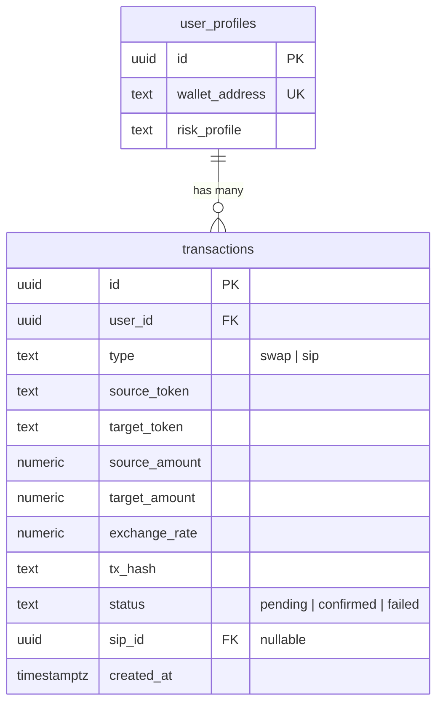

# Mento Swap Integration (Milestone 4)

## Overview

Implement end-to-end token swap functionality using the Mento protocol on Celo. Users can swap USDC/USDT into any Mento stablecoin (USDm, EURm, BRLm, KESm, etc.) or XAUT (Tether Gold) through a non-custodial flow where the backend prepares quotes and the frontend handles wallet signing via thirdweb v5.

## Problem Statement

Users currently have no way to trade tokens on the platform. M1-M3 established auth, onboarding, and market data viewing, but there's no swap execution capability. M4 bridges the gap between viewing prices and actually investing in FX tokens.

## Technical Approach

### Architecture

The swap flow is **non-custodial**: backend reads on-chain state (quotes, exchange routing) but never holds keys. Frontend uses thirdweb v5 hooks to prompt wallet signatures.

```
User → Frontend (amount, tokens) → Backend API (quote) → Mento Broker Contract (on-chain read)
User ← Frontend (display quote)  ← Backend API (quote response)
User → Frontend (sign tx)        → Celo Network (on-chain write via wallet)
User ← Frontend (confirmation)   ← Celo Network (tx receipt)
                                  → Backend API (record tx in DB)
```

**Key decision: Direct viem contract calls vs Mento SDK**

The existing `price-service.ts` already uses direct viem `readContract` calls to the Mento Broker (`0x777A8255cA72412f0d706dc03C9D1987306B4CaD`) and BiPoolManager (`0x22d9db95E6Ae61c104A7B6F6C78D7993B94ec901`). The Mento SDK v2 beta has viem support, but the stable v1 only supports ethers.js.

**Recommended approach:** Continue using direct viem contract calls (consistent with existing codebase) for the `packages/contracts` wrapper. This avoids adding ethers.js as a dependency and leverages the proven patterns from `price-service.ts`.

### Implementation Phases

#### Phase 1: `packages/contracts` — Mento SDK Wrapper

Create a new workspace package that centralizes all Mento contract interactions.

**Structure:**
```
packages/contracts/
├── src/
│   ├── index.ts                 # Public exports
│   ├── abis/
│   │   ├── broker.ts            # Broker ABI (extract from price-service.ts)
│   │   ├── bipool-manager.ts    # BiPoolManager ABI
│   │   └── erc20.ts             # Standard ERC20 ABI (approve, allowance, balanceOf)
│   ├── addresses.ts             # Contract addresses by chainId (mainnet + Alfajores)
│   ├── exchanges.ts             # Exchange pair registry (exchangeId mappings)
│   ├── quote.ts                 # getQuote() — read-only quote fetching
│   ├── allowance.ts             # checkAllowance(), buildApproveTx()
│   └── swap.ts                  # buildSwapInTx() — prepare unsigned swap tx
├── package.json
└── tsconfig.json
```

**Key functions to implement:**

```typescript
// packages/contracts/src/quote.ts
export async function getQuote(params: {
  tokenIn: Address;
  tokenOut: Address;
  amountIn: bigint;
  celoClient: PublicClient;
}): Promise<{
  amountOut: bigint;
  exchangeProvider: Address;
  exchangeId: `0x${string}`;
  rate: number;
}>

// packages/contracts/src/allowance.ts
export async function checkAllowance(params: {
  token: Address;
  owner: Address;
  spender: Address;  // Broker address
  celoClient: PublicClient;
}): Promise<bigint>

export function buildApproveTx(params: {
  token: Address;
  spender: Address;  // Broker address
  amount: bigint;    // Use max uint256 for infinite approval
}): { to: Address; data: `0x${string}` }

// packages/contracts/src/swap.ts
export function buildSwapInTx(params: {
  exchangeProvider: Address;
  exchangeId: `0x${string}`;
  tokenIn: Address;
  tokenOut: Address;
  amountIn: bigint;
  amountOutMin: bigint;  // quote.amountOut * (1 - slippage)
}): { to: Address; data: `0x${string}` }
```

**Exchange pair resolution:** Extract the routing logic from `apps/api/src/services/price-service.ts` which already builds a routing table from BiPoolManager's `getExchanges()`. Cache exchange metadata in-memory with 5-minute TTL.

**Decimal handling strategy:**
- USDC/USDT: 6 decimals
- All Mento stablecoins: 18 decimals
- XAUT: 6 decimals (per Tether specification)
- Frontend sends human-readable amounts as strings
- Backend converts using `parseUnits(amount, tokenDecimals)` before contract calls
- Quote response returns both raw (bigint string) and formatted amounts

**Files to create:**
- `packages/contracts/package.json`
- `packages/contracts/tsconfig.json`
- `packages/contracts/src/index.ts`
- `packages/contracts/src/abis/broker.ts`
- `packages/contracts/src/abis/bipool-manager.ts`
- `packages/contracts/src/abis/erc20.ts`
- `packages/contracts/src/addresses.ts`
- `packages/contracts/src/exchanges.ts`
- `packages/contracts/src/quote.ts`
- `packages/contracts/src/allowance.ts`
- `packages/contracts/src/swap.ts`

**Files to modify:**
- `packages/shared/src/types/tokens.ts` — add token decimals + contract addresses if not already present
- `apps/api/src/services/price-service.ts` — refactor to use `@autoclaw/contracts` instead of inline ABIs
- `package.json` (root) — add workspace entry for `packages/contracts`

---

#### Phase 2: Backend Trade API Routes

**File:** `apps/api/src/routes/trade.ts`

Three endpoints, all protected by `authMiddleware`:

##### `POST /api/trade/quote`

**Request:**
```typescript
{
  from: string;       // Token symbol: "USDC" | "USDT"
  to: string;         // Token symbol: "EURm" | "USDm" | "XAUT" | ...
  amount: string;     // Human-readable amount: "100"
  slippage?: number;  // Percentage: 0.5 (default)
}
```

**Response:**
```typescript
{
  estimatedAmountOut: string;      // "108.23" (human-readable)
  estimatedAmountOutRaw: string;   // "108230000000000000000" (wei)
  minimumAmountOut: string;        // "107.69" (after slippage)
  minimumAmountOutRaw: string;     // wei string
  exchangeRate: string;            // "1.0823"
  priceImpact: number;             // 0.02 (percentage)
  estimatedGasCelo: string;        // "0.001" (CELO)
  exchangeProvider: string;        // Address
  exchangeId: string;              // bytes32
  // Transaction data for frontend to send
  approveTx?: {                    // null if sufficient allowance
    to: string;
    data: string;
  };
  swapTx: {
    to: string;
    data: string;
  };
}
```

**Logic:**
1. Resolve token symbols → addresses from `@autoclaw/shared`
2. Parse `amount` to bigint using token decimals
3. Call `getQuote()` from `@autoclaw/contracts`
4. Check user's allowance for the Broker contract
5. Calculate `minimumAmountOut` = `amountOut * (100 - slippage) / 100`
6. Build swap tx data using `buildSwapInTx()`
7. If allowance insufficient, also build approve tx using `buildApproveTx()`
8. Estimate gas using `celoClient.estimateGas()`
9. Return everything frontend needs to execute

**Validation (zod):**
- `from` must be "USDC" or "USDT"
- `to` must be valid Mento token symbol or "XAUT"
- `amount` must be positive number string
- `slippage` must be 0.01-50 if provided

##### `POST /api/trade/execute`

Records a completed swap in the database. Called by frontend after on-chain confirmation.

**Request:**
```typescript
{
  txHash: string;           // Transaction hash
  from: string;             // Source token symbol
  to: string;               // Target token symbol
  amountIn: string;         // Human-readable input amount
  amountOut: string;        // Human-readable output amount
  exchangeRate: string;
}
```

**Response:**
```typescript
{
  id: string;               // Transaction record UUID
  status: "confirmed";
}
```

**Logic:**
1. Validate txHash format (0x + 64 hex chars)
2. Look up user by wallet address (from auth middleware)
3. Resolve user_id from `user_profiles` table
4. Insert into `transactions` table with `type: 'swap'`, `status: 'confirmed'`
5. Return transaction record ID

**Future enhancement:** Verify txHash on-chain before recording (check `from` address matches, token addresses match, amounts are reasonable). For MVP, trust frontend data.

##### `GET /api/trade/history`

**Query params:**
- `page` (default 1)
- `limit` (default 50, max 100)
- `token` (optional filter by source or target token symbol)
- `status` (optional: "confirmed" | "failed")

**Response:**
```typescript
{
  transactions: Array<{
    id: string;
    type: "swap";
    sourceToken: string;       // Symbol
    targetToken: string;
    sourceAmount: string;
    targetAmount: string;
    exchangeRate: string;
    txHash: string;
    status: string;
    createdAt: string;         // ISO datetime
  }>;
  pagination: {
    page: number;
    limit: number;
    total: number;
    hasMore: boolean;
  };
}
```

**Files to create:**
- `apps/api/src/routes/trade.ts`

**Files to modify:**
- `apps/api/src/index.ts` — register `tradeRoutes`

---

#### Phase 3: Swap Page UI (`/app/swap`)

##### 3a. Swap Page Layout

**File:** `apps/web/src/app/swap/page.tsx`

Following existing page pattern (ProtectedRoute wrapper, client component):

```
┌──────────────────────────────┐
│  Header (logo + avatar)       │
├──────────────────────────────┤
│                               │
│  ┌──────────────────────┐    │
│  │  FROM                 │    │
│  │  [USDC ▼]    [100  ] │    │
│  │  Balance: 500.00      │    │
│  └──────────────────────┘    │
│           [⇅ switch]         │
│  ┌──────────────────────┐    │
│  │  TO                   │    │
│  │  [EURm ▼]   ~108.23  │    │
│  │  Balance: 0.00        │    │
│  └──────────────────────┘    │
│                               │
│  1 USDC = 1.0823 EURm   [⚙] │
│  Price impact: 0.02%         │
│  Network fee: ~0.001 CELO    │
│                               │
│  [■■■■ Swap ■■■■]           │
│                               │
├──────────────────────────────┤
│  Bottom Nav (Home|Chat|Swap|) │
└──────────────────────────────┘
```

**Swap states (component state machine):**
- `idle` — no tokens selected or amount empty
- `loading-quote` — fetching quote from API
- `quote-ready` — quote displayed, swap button enabled
- `approving` — approval tx pending (wallet popup + on-chain)
- `swapping` — swap tx pending (wallet popup + on-chain)
- `confirmed` — success toast, balances refreshed
- `error` — error toast with retry option

**Files to create:**
- `apps/web/src/app/swap/page.tsx`
- `apps/web/src/components/swap/swap-card.tsx` — main swap UI
- `apps/web/src/components/swap/swap-token-input.tsx` — token selector + amount input row
- `apps/web/src/components/swap/swap-details.tsx` — rate, price impact, gas display
- `apps/web/src/components/swap/slippage-settings.tsx` — gear icon dropdown

##### 3b. Token Selector Modal

**File:** `apps/web/src/components/swap/token-selector-modal.tsx`

Full-screen modal on mobile, centered modal on desktop.

**Features:**
- Search input at top (case-insensitive, matches symbol + name + country)
- Token list with: flag emoji, symbol, full name, user balance
- Recent tokens section (stored in localStorage)
- Balances fetched in parallel on modal open via multicall
- XAUT row has gold accent color
- Tap to select → modal closes, parent updates

**Token data source:** `TOKEN_METADATA` from `@autoclaw/shared` (already has flags, names, symbols)

**Balance fetching:** Use viem `multicall` to batch ERC20 `balanceOf` calls for all tokens in a single RPC request.

**Files to create:**
- `apps/web/src/components/swap/token-selector-modal.tsx`

##### 3c. Swap Confirmation Flow

**Multi-step within the swap page (no separate page):**

1. User enters amount → auto-fetch quote (debounced 500ms)
2. Quote displays with rate, impact, fee
3. User clicks "Swap" button:
   - If approval needed: button says "Approve USDC" → wallet popup → wait for receipt → button changes to "Swap"
   - If no approval needed: button says "Swap" → wallet popup → wait for receipt
4. On success: toast notification + balance refresh
5. On failure: error toast with reason + retry button

**Transaction execution using thirdweb v5:**
```typescript
import { useSendTransaction } from 'thirdweb/react';
import { prepareTransaction } from 'thirdweb';

// Build transaction from API response
const tx = prepareTransaction({
  to: quoteResponse.swapTx.to,
  data: quoteResponse.swapTx.data,
  chain: celo,
  client: thirdwebClient,
});

// Send (prompts wallet)
sendTransaction(tx, {
  onSuccess: (result) => { /* track pending tx */ },
  onError: (err) => { /* show error toast */ },
});
```

##### 3d. Transaction Toast Notifications

Use **sonner** (already popular in shadcn/ui ecosystem, 2-3KB, zero deps).

**Toast patterns:**
- `toast.loading("Approving USDC...")` — during approval
- `toast.loading("Swapping USDC → EURm...")` — during swap
- `toast.success("Swap confirmed! Received 108.23 EURm")` — with "View on CeloScan" action button
- `toast.error("Swap failed: Slippage exceeded")` — with "Retry" action button

**Files to create:**
- `apps/web/src/components/ui/toast-provider.tsx` (Sonner `<Toaster />` wrapper)

**Files to modify:**
- `apps/web/src/app/layout.tsx` — add `<Toaster />` to root layout

---

#### Phase 4: XAUT Swap Support

XAUT uses the same swap flow as Mento stablecoins but with visual differentiation.

**Functional differences:**
- XAUT may not be available through Mento Broker directly — check exchange availability. If not available via Mento, use a DEX aggregator fallback or CoinGecko price for quotes.
- XAUT has 6 decimals (like USDC), not 18 like Mento stables

**Visual differences:**
- Gold accent color (`#D4A017` from Tailwind config `gold`) on token card
- Gold icon (already using flag emoji from TOKEN_METADATA)
- Quote display shows "per oz" equivalent alongside token price

**Files to modify:**
- `apps/web/src/components/swap/swap-card.tsx` — conditional gold styling when XAUT selected
- `packages/contracts/src/quote.ts` — XAUT-specific quote logic if not available via Broker

---

#### Phase 5: Navigation Integration

**Token detail page → Swap:**
- `/app/home/:token` "Buy" button navigates to `/app/swap?to=EURm`
- Swap page reads `?to` query param and pre-selects target token

**Bottom nav:**
- Swap tab already defined in spec, add to `BottomNav` component
- Active state when on `/app/swap`

**Files to modify:**
- `apps/web/src/app/home/[token]/page.tsx` — add "Buy" button linking to `/app/swap?to={token}`
- `apps/web/src/components/bottom-nav.tsx` — add Swap tab if not already present

---

## Alternative Approaches Considered

1. **Mento SDK (ethers.js):** Would add ethers.js as dependency alongside viem. Rejected because existing codebase is viem-only and direct contract calls are proven in price-service.ts.

2. **Mento SDK v2 beta (viem):** Supports viem but is beta. Risky for production. Could revisit when stable.

3. **Backend-signed transactions:** Backend holds a hot wallet and executes swaps on behalf of users. Rejected because it's custodial and introduces key management risks.

4. **Frontend-only (no backend API):** Frontend calls contracts directly. Rejected because quote preparation, exchange routing, and transaction recording benefit from backend logic.

## Acceptance Criteria

From MILESTONES.md verification checklist:

- [x] `POST /api/trade/quote` with `{ from: "USDC", to: "EURm", amount: "100" }` returns valid quote with `amountOut`, `rate`, `slippage`, `estimatedGas`
- [x] Quote response time < 500ms (cached Mento quotes)
- [x] Swap page: selecting USDC and EURm, entering 100, shows live quote
- [x] Clicking "Swap" triggers wallet popup for allowance approval (if first time)
- [x] After allowance, second wallet popup for swap transaction
- [x] Transaction hash appears in toast notification as "pending"
- [x] After on-chain confirmation (~5s), toast updates to "confirmed" with CeloScan link
- [x] Transaction recorded in `transactions` table with correct amounts, hash, status
- [x] `/api/trade/history` returns the new transaction
- [x] Slippage protection: swap reverts if actual rate deviates > configured max (default 0.5%)
- [x] XAUT swap works: USDC → XAUT, shows gold accent styling
- [x] Token selector: typing "eur" filters to EURm, typing "gold" shows XAUT

### Additional acceptance criteria (from flow analysis):

- [x] Insufficient balance shows inline error before user attempts swap
- [x] Amount input validates: positive numbers only, max decimals per token, no negative
- [x] Existing allowance detected → approval step skipped
- [x] User can change slippage via settings gear (presets: 0.1%, 0.5%, 1.0%, custom)
- [x] Quote auto-refreshes every 30s while on page
- [x] Failed transaction shows error toast with specific reason
- [x] Back navigation from swap page works correctly
- [x] `/app/swap?to=EURm` pre-selects EURm as target token
- [x] Mobile: numeric keyboard for amount input, full-screen token selector
- [x] Transaction history paginated (50 per page)

## Dependencies & Risks

**Dependencies:**
- Mento Broker contract must be operational on Celo mainnet
- Celo RPC (forno.celo.org) must be responsive for quotes
- thirdweb v5 wallet connection must work for transaction signing
- `sonner` package needs to be added for toasts

**Risks:**
- **Mento exchange routing complexity:** Some token pairs may require multi-hop routing (e.g., USDC → USDm → EURm). The routing table from BiPoolManager handles this, but edge cases may exist.
- **XAUT availability:** XAUT may not be available through Mento Broker. Need to verify exchange pair existence; may need alternative swap path.
- **Gas estimation accuracy:** Celo gas is cheap but estimation must account for approval + swap in separate transactions.
- **Quote staleness:** Quotes can go stale in volatile markets. 30s auto-refresh mitigates but doesn't eliminate.

## Success Metrics

- Swap completion rate > 90% (of initiated swaps)
- Quote-to-swap time < 15 seconds (user experience)
- API quote response < 500ms (p95)
- Zero stuck/unresolved transactions in first week

## ERD (Relevant Tables)



## References

### Internal
- `apps/api/src/services/price-service.ts` — existing Mento Broker integration pattern
- `apps/api/src/routes/user.ts` — route structure reference
- `apps/api/src/middleware/auth.ts` — auth middleware pattern
- `apps/web/src/app/home/page.tsx` — page structure reference
- `apps/web/src/components/ui/chip.tsx` — chip selector pattern for token selector
- `packages/shared/src/types/tokens.ts` — token metadata and addresses

### External
- [Mento SDK GitHub](https://github.com/mento-protocol/mento-sdk) — SDK source and examples
- [Mento Docs: Initiate a Swap](https://docs.mento.org/mento/build-on-mento/mento-sdk/guides/initiating-a-swap)
- [Mento Docs: Integrate the Broker](https://docs.mento.org/mento/build-on-mento/integration-overview/integrate-the-broker)
- [Mento Contract Addresses](https://docs.mento.org/mento/developers/deployments/addresses)
- [thirdweb v5 Transaction Docs](https://portal.thirdweb.com/typescript/v5/transactions/prepare)
- [Sonner Toast Library](https://sonner.emilkowal.dev/)
- [viem Documentation](https://viem.sh/)

## File Summary

### New Files (15)
| File | Purpose |
|------|---------|
| `packages/contracts/package.json` | Package config |
| `packages/contracts/tsconfig.json` | TS config |
| `packages/contracts/src/index.ts` | Public exports |
| `packages/contracts/src/abis/broker.ts` | Broker ABI |
| `packages/contracts/src/abis/bipool-manager.ts` | BiPoolManager ABI |
| `packages/contracts/src/abis/erc20.ts` | ERC20 ABI |
| `packages/contracts/src/addresses.ts` | Contract addresses |
| `packages/contracts/src/exchanges.ts` | Exchange pair registry |
| `packages/contracts/src/quote.ts` | getQuote() |
| `packages/contracts/src/allowance.ts` | checkAllowance(), buildApproveTx() |
| `packages/contracts/src/swap.ts` | buildSwapInTx() |
| `apps/api/src/routes/trade.ts` | Trade API routes |
| `apps/web/src/app/swap/page.tsx` | Swap page |
| `apps/web/src/components/swap/swap-card.tsx` | Swap card UI |
| `apps/web/src/components/swap/swap-token-input.tsx` | Token + amount input |
| `apps/web/src/components/swap/swap-details.tsx` | Rate/impact/fee display |
| `apps/web/src/components/swap/slippage-settings.tsx` | Slippage config |
| `apps/web/src/components/swap/token-selector-modal.tsx` | Token picker modal |
| `apps/web/src/components/ui/toast-provider.tsx` | Sonner toast wrapper |

### Modified Files (6)
| File | Change |
|------|--------|
| Root `package.json` | Add `packages/contracts` workspace |
| `apps/api/src/index.ts` | Register `tradeRoutes` |
| `apps/api/src/services/price-service.ts` | Refactor to use `@autoclaw/contracts` |
| `apps/web/src/app/layout.tsx` | Add `<Toaster />` |
| `apps/web/src/components/bottom-nav.tsx` | Add Swap tab |
| `apps/web/src/app/home/[token]/page.tsx` | Add "Buy" button linking to swap |

### New Dependencies
| Package | Location | Purpose |
|---------|----------|---------|
| `sonner` | `apps/web` | Toast notifications |
| `viem` | `packages/contracts` | Already in workspace, peer dep |
