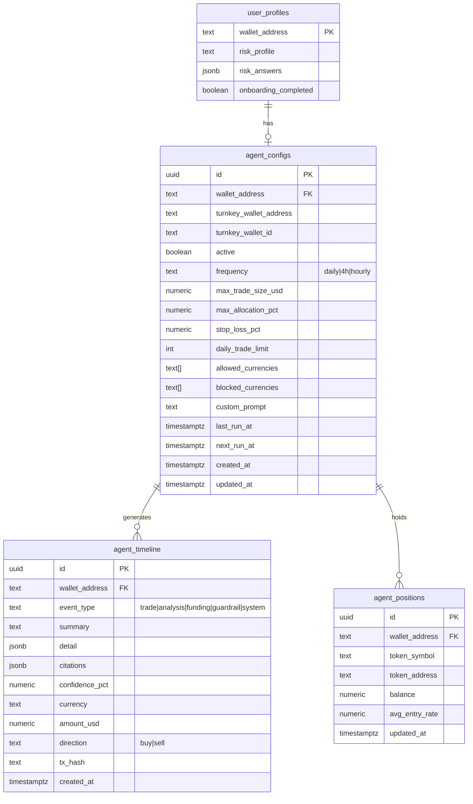

# Part 1: FX Trading Agent — Backend Foundation

Database schema, Turnkey wallet integration, agent cron skeleton, rules engine, and API routes. This is the data layer and server-side infrastructure that Parts 2 and 3 build on.

## Overview

Set up the foundational backend for the autonomous FX trading agent: database tables for agent config/state/timeline, Turnkey server-side wallet creation during onboarding, the cron service skeleton, a deterministic rules engine, and REST API routes for the frontend to consume.

## Proposed Solution

### Database Schema

New migration: `supabase/migrations/20260211000000_add_agent_tables.sql`



**Key decisions:**
- `agent_configs` has a 1:1 relationship with `user_profiles` via `wallet_address`
- `agent_timeline` is the single event log — all event types (TRADE, ANALYSIS, FUNDING, GUARDRAIL, SYSTEM) go here
- `agent_positions` tracks current holdings per token (updated after each trade)
- `detail` jsonb column holds type-specific data (full LLM reasoning for trades, source list for analysis, rule name for guardrails)
- `citations` jsonb array holds Parallel AI search result references `[{url, title, excerpt}]`
- RLS policies follow existing pattern: `current_setting('app.wallet_address', true)`

### Turnkey Wallet Integration

**New files:**
- `apps/api/src/lib/turnkey.ts` — Turnkey client singleton
- `apps/api/src/lib/turnkey-wallet.ts` — Wallet creation + viem account factory

```typescript
// apps/api/src/lib/turnkey.ts
import { Turnkey } from '@turnkey/sdk-server';

export const turnkey = new Turnkey({
  apiBaseUrl: 'https://api.turnkey.com',
  apiPublicKey: process.env.TURNKEY_API_PUBLIC_KEY!,
  apiPrivateKey: process.env.TURNKEY_API_PRIVATE_KEY!,
  defaultOrganizationId: process.env.TURNKEY_ORGANIZATION_ID!,
});
```

```typescript
// apps/api/src/lib/turnkey-wallet.ts
import { createAccount } from '@turnkey/viem';
import { createWalletClient, http } from 'viem';
import { celo } from 'viem/chains';
import { turnkey } from './turnkey';

export async function createAgentWallet(userId: string) {
  const apiClient = turnkey.apiClient();
  const wallet = await apiClient.createWallet({
    walletName: `agent-${userId}`,
    accounts: [{
      curve: 'CURVE_SECP256K1',
      pathFormat: 'PATH_FORMAT_BIP32',
      path: "m/44'/60'/0'/0/0",
    }],
  });
  return {
    walletId: wallet.walletId,
    address: wallet.addresses[0],
  };
}

export async function getAgentWalletClient(turnkeyAddress: string) {
  const account = await createAccount({
    client: turnkey.apiClient(),
    organizationId: process.env.TURNKEY_ORGANIZATION_ID!,
    signWith: turnkeyAddress,
  });
  return createWalletClient({
    account,
    chain: celo,
    transport: http(process.env.CELO_RPC_URL),
  });
}
```

**Onboarding update** — after risk profile is saved, create Turnkey wallet and store in `agent_configs`:
- Update `POST /api/user/risk-profile` handler in `apps/api/src/routes/user.ts`
- After inserting risk profile, call `createAgentWallet(walletAddress)`
- Insert into `agent_configs` with default guardrails based on risk profile
- Return `turnkey_wallet_address` in response

### Rules Engine

**New file:** `apps/api/src/services/rules-engine.ts`

Pure functions, no side effects, fully deterministic:

```typescript
// apps/api/src/services/rules-engine.ts

export interface Signal {
  currency: string;
  direction: 'buy' | 'sell';
  confidence: number;
  reasoning: string;
}

export interface GuardrailCheck {
  passed: boolean;
  blocked_reason?: string;
  rule_name?: string;
}

export function checkGuardrails(params: {
  signal: Signal;
  config: AgentConfig;
  positions: AgentPosition[];
  portfolioValueUsd: number;
  tradesToday: number;
}): GuardrailCheck { ... }
```

Rules checked in order:
1. Currency is in `allowed_currencies` and not in `blocked_currencies`
2. `tradesToday < daily_trade_limit`
3. Trade size `<= max_trade_size_usd`
4. Post-trade allocation for this currency `<= max_allocation_pct`
5. No stop-loss triggered for this currency

### Agent Cron Skeleton

**New file:** `apps/api/src/services/agent-cron.ts`

Follow existing `snapshot-cron.ts` pattern:

```typescript
// apps/api/src/services/agent-cron.ts

const TICK_INTERVAL_MS = 60_000; // Check every minute

export function startAgentCron(): void {
  console.log('Starting agent cron (tick every 60s)');
  agentTick();
  setInterval(agentTick, TICK_INTERVAL_MS);
}

async function agentTick(): Promise<void> {
  // 1. Query agent_configs WHERE active = true AND next_run_at <= now()
  // 2. For each agent due to run, call runAgentCycle(config)
  // 3. Update next_run_at based on frequency
}

export async function runAgentCycle(config: AgentConfig): Promise<void> {
  // Skeleton — Part 2 fills this in with:
  // 1. Fetch news (Parallel AI)
  // 2. LLM analysis (AI SDK)
  // 3. Rules engine check
  // 4. Execute trade (Mento Broker + Turnkey)
  // 5. Log to agent_timeline
}
```

### API Routes

**New file:** `apps/api/src/routes/agent.ts`

All routes use `authMiddleware`:

| Method | Route | Description |
|--------|-------|-------------|
| `GET` | `/api/agent/status` | Agent config, active state, next run time, portfolio summary |
| `POST` | `/api/agent/toggle` | Pause or resume agent (sets `active` flag) |
| `GET` | `/api/agent/timeline` | Paginated timeline entries (query params: `type`, `limit`, `offset`) |
| `GET` | `/api/agent/timeline/:id` | Single timeline entry with full detail |
| `PUT` | `/api/agent/settings` | Update guardrail configuration |
| `GET` | `/api/agent/positions` | Current token holdings |
| `GET` | `/api/agent/portfolio` | Portfolio value breakdown (positions + current prices) |

### Funding Detection

**New file:** `apps/api/src/services/funding-monitor.ts`

Runs on the same cron tick — checks the Turnkey wallet for incoming transfers:

```typescript
// Check for new deposits of USDm, USDC, USDT
// If USDC or USDT received, auto-convert to USDm via Mento Broker
// Log FUNDING event to agent_timeline
```

Uses viem `getBalance` + ERC20 `balanceOf` calls against the Turnkey wallet address.

## Acceptance Criteria

- [x] Migration creates `agent_configs`, `agent_timeline`, `agent_positions` tables with RLS
- [x] `pnpm add @turnkey/http @turnkey/api-key-stamper @turnkey/viem` in `apps/api`
- [x] Turnkey client singleton at `apps/api/src/lib/turnkey.ts`
- [x] `createAgentWallet()` and `getAgentWalletClient()` functions work
- [x] Onboarding flow creates Turnkey wallet and inserts `agent_configs` row
- [x] Default guardrails set based on risk profile (conservative/moderate/aggressive)
- [x] Rules engine passes/blocks signals correctly for all 5 guardrail types
- [x] Agent cron starts on server boot, ticks every 60s, picks up due agents
- [x] `runAgentCycle()` skeleton exists (Part 2 fills in the intelligence)
- [x] All 7 API routes work with auth middleware
- [x] Timeline pagination works with `limit` and `offset`
- [x] Funding monitor detects USDm/USDC/USDT deposits and logs them
- [x] Environment variables added: `TURNKEY_API_PUBLIC_KEY`, `TURNKEY_API_PRIVATE_KEY`, `TURNKEY_ORGANIZATION_ID`

## Dependencies & Risks

- **Turnkey account setup** — need API keys from Turnkey dashboard before development
- **Turnkey pricing** — open question from brainstorm (wallet creation cost at scale)
- **XAUT address** — still placeholder `0x000...000`, need real Tether Gold address on Celo

## Files to Create / Modify

| Action | File |
|--------|------|
| Create | `supabase/migrations/20260211000000_add_agent_tables.sql` |
| Create | `apps/api/src/lib/turnkey.ts` |
| Create | `apps/api/src/lib/turnkey-wallet.ts` |
| Create | `apps/api/src/services/rules-engine.ts` |
| Create | `apps/api/src/services/agent-cron.ts` |
| Create | `apps/api/src/services/funding-monitor.ts` |
| Create | `apps/api/src/routes/agent.ts` |
| Modify | `apps/api/src/routes/user.ts` (onboarding → create wallet) |
| Modify | `apps/api/src/index.ts` (register agent routes + start cron) |
| Modify | `packages/db/src/types.ts` (regenerate after migration) |
| Modify | `apps/api/.env.example` (add Turnkey vars) |

## References

- Brainstorm: `docs/brainstorms/2026-02-10-fx-trading-agent-pivot-brainstorm.md`
- Existing cron pattern: `apps/api/src/services/snapshot-cron.ts`
- Existing route pattern: `apps/api/src/routes/trade.ts`
- Auth middleware: `apps/api/src/middleware/auth.ts`
- DB package: `packages/db/src/index.ts`
- Mento swap layer: `packages/contracts/src/swap.ts`
- Turnkey skill: `.claude/skills/turnkey/SKILL.md`
